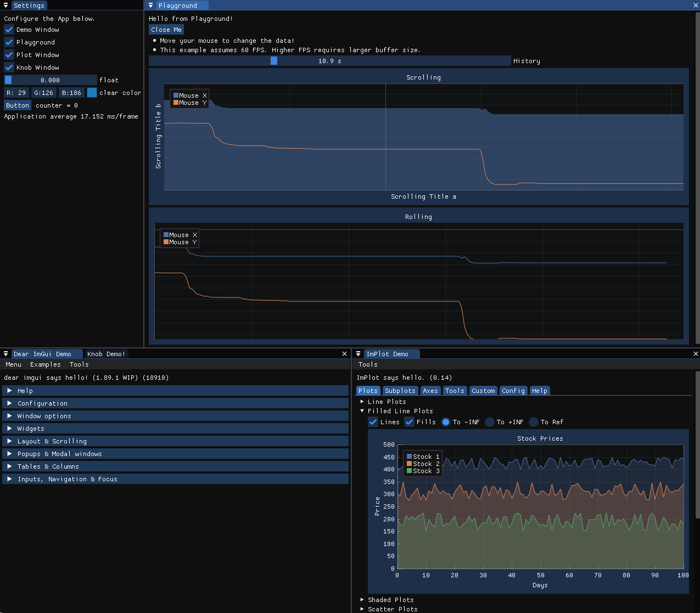

# Dear ImGui with GLFW + OpenGL3

[**Dear ImGui**](https://github.com/ocornut/imgui) is a bloat-free graphical user interface library for C++. It outputs optimized vertex buffers that you can render anytime in your 3D-pipeline-enabled application. It is fast, portable, renderer agnostic, and self-contained (no external dependencies).

*This sample uses Dear ImGui with GLFW + OpenGL3*

[**GLFW**](https://www.glfw.org/) (Graphics Library Framework) is an Open Source, multi-platform library for OpenGL, OpenGL ES and Vulkan development on the desktop. It provides a simple API for creating windows, contexts and surfaces, receiving input and events.

[**OpenGL**](https://www.opengl.org/) (Open Graphics Library) is a cross-language, cross-platform application programming interface (API) for rendering 2D and 3D vector graphics. The API is typically used to interact with a graphics processing unit (GPU), to achieve hardware-accelerated rendering.

## Install and Configure
### On Windows
Install dependencies using [vcpkg - (VC++ Package Manager)](https://vcpkg.io/en/index.html) 
```bash
# Clone this repository with recursive option
> git clone --recursive https://github.com/sukesh-ak/ImGui-GLFW-OpenGL3
> cd ImGui-GLFW-OpenGL3

# Run the bootstrap script for vcpkg
> .\vcpkg\bootstrap-vcpkg.bat

# Install imgui dependencies using vcpkg manifest (vcpkg.json)
> .\vcpkg\vcpkg install 

# Compile and Run (or run  .\win-build.bat)
> cmake . -B build/
> cmake --build build
> build\Debug\ImGui-GLFW-OpenGL3.exe

```
We are ready to open the project in Visual Studio and Run too!  
Use `Open Folder` option in Visual Studio to use `CMake` support.


### On Linux/WSL2
Install dependencies using [vcpkg - (VC++ Package Manager)](https://vcpkg.io/en/index.html) 

```bash
# Clone this repository with recursive option
$ git clone --recursive https://github.com/sukesh-ak/ImGui-GLFW-OpenGL3
$ cd ImGui-GLFW-OpenGL3

# Run the bootstrap script for vcpkg
$ ./vcpkg/bootstrap-vcpkg.sh

# Install dependencies required (will add to manifest later)
$ sudo apt install libxinerama-dev libxcursor-dev xorg-dev libglu1-mesa-dev pkg-config

# Install OpenGL for WSL (if it complains during compilation)
$ sudo apt install mesa-utils libglu1-mesa-dev freeglut3-dev mesa-common-dev


# Install imgui dependencies using vcpkg manifest (vcpkg.json)
$ ./vcpkg/vcpkg install 

# Compile and Run (or run ./linux-build.sh)
$ cmake . -B build/ 
$ cmake --build build
$ ./build/ImGui-GLFW-OpenGL3

```
That's it!

### Screenshot
  

## Docs and Helpful links
- Live Documentation [here](https://pthom.github.io/imgui_manual_online/manual/imgui_manual.html)
- Docs on Examples [here](https://github.com/ocornut/imgui/blob/master/docs/EXAMPLES.md)
- Wiki with examples and usage [here](https://github.com/ocornut/imgui/wiki)
- Useful Extensions [here](https://github.com/ocornut/imgui/wiki/Useful-Extensions)
## Credits
- Dear ImGui - https://github.com/ocornut/imgui  
- GLFW - https://www.glfw.org/  
- OpenGL - https://www.opengl.org/  
- ImPlot - https://github.com/epezent/implot  
- ImGui Knobs - https://github.com/altschuler/imgui-knobs  
- ImSpinner - https://github.com/dalerank/imspinner


